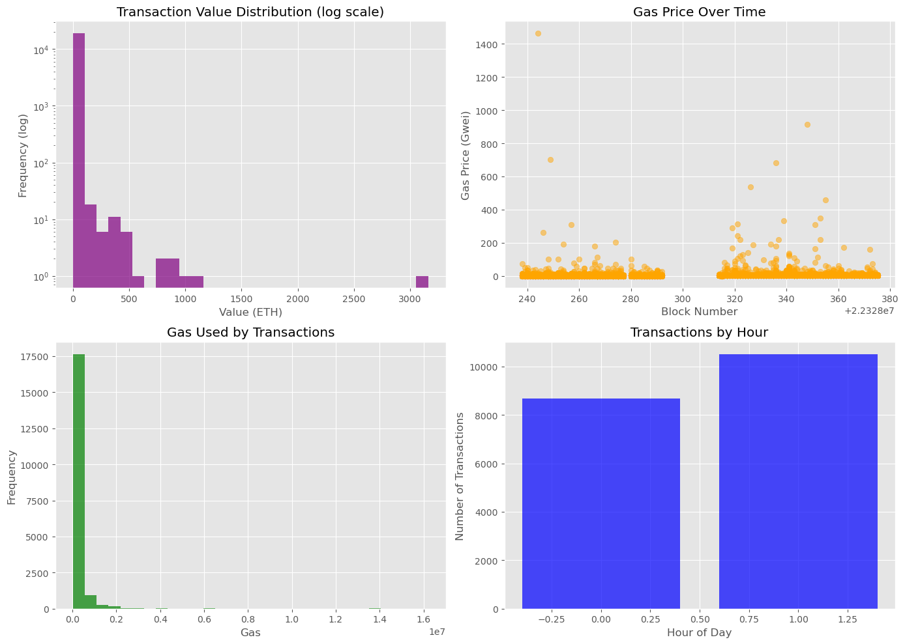
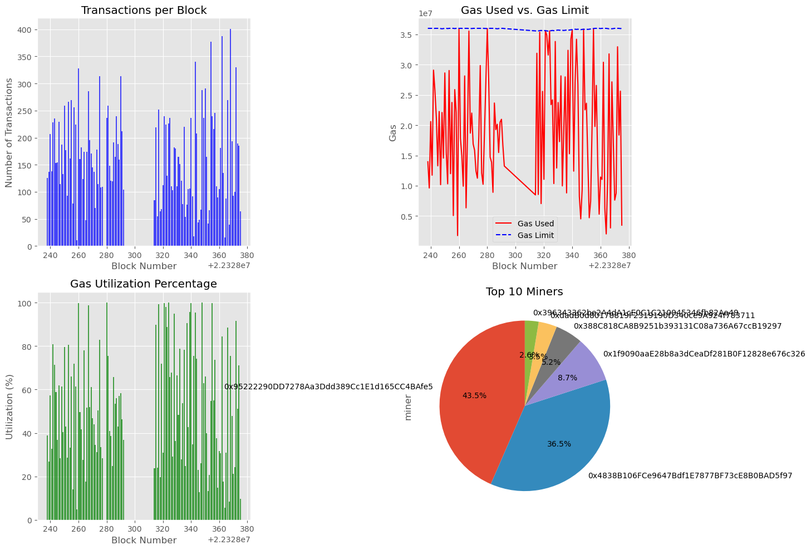
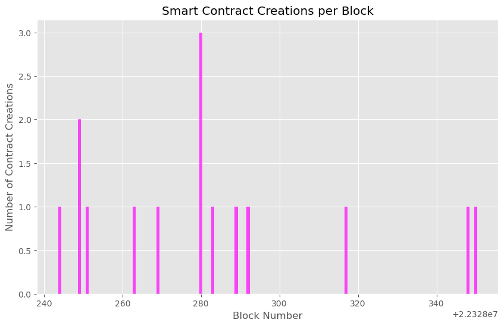
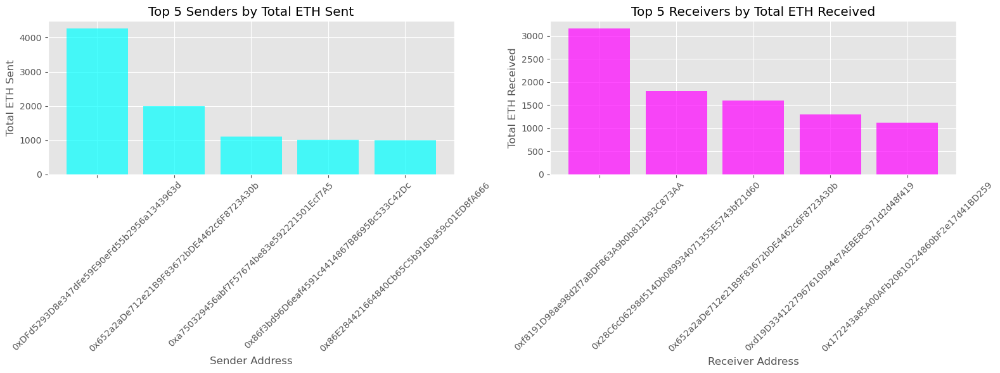

## Project Overview and Requirements

This project monitors Ethereum blockchain data by connecting to a public RPC endpoint using the Web3 library. It retrieves block and transaction data from a single Ethereum node (via Infura), stores it in a local database, and visualizes network activity through an interactive dashboard. It does not perform full peer-to-peer crawling; instead, it passively logs chain data through remote procedure calls (RPC).

### Dependencies

To run this project, install the following Python packages:

- `web3` – [Web3.py Documentation](https://web3py.readthedocs.io/)
- `pandas`
- `matplotlib`
- `seaborn`
- `ipywidgets`
- `sqlite3` – Standard with Python
- Jupyter Notebook or JupyterLab (recommended for interactive use)

Install with:

```bash
pip install web3 pandas matplotlib seaborn ipywidgets
```

### External Requirement: Infura API Key

This project connects to the Ethereum network through Infura, which provides scalable blockchain infrastructure. You will need to register for a free account and create a project to obtain your API key.

- Sign up at: [https://infura.io/register](https://infura.io/register)
- After logging in, create a new Ethereum project
- Copy the Project ID (API key) and paste it into the code where specified

For reference: [Infura Ethereum Docs](https://docs.infura.io/infura/networks/ethereum)

### Limitations

The project uses a lightweight SQLite database to store blockchain data. While suitable for quick access and limited use cases, it is not optimized for high-volume or long-running monitoring. Storing a large number of blocks or leaving the listener running for extended periods may cause memory issues or crashes.

For production-grade data collection or analysis at scale, it is recommended to switch to a more robust backend such as PostgreSQL, and implement data batching, pruning, or archiving strategies.
-----------------------------------------------------------------------------------------------------------------------------------------------------------------------------

# Blockchain Crawler & Dashboard

## Project Summary
This tool is a lightweight Ethereum blockchain crawler and real-time listener. It connects to the Ethereum network using Infura, fetches block and transaction data, stores it in a local SQLite database, and visualizes key metrics through an interactive dashboard built with Python widgets and plotting libraries.

The goal of the crawler is to offer a simple but insightful view into Ethereum network activity—making it easier to analyze gas usage trends, miner behavior, transaction value distributions, and more.

---

## How It Works
1. **Connection to Ethereum:** The crawler uses the Web3 library to connect to Ethereum’s Sepolia testnet via Infura.
2. **Data Collection:**
   - Blocks and transactions are fetched from the latest block backward.
   - Alternatively, a listener mode monitors and records blocks in real-time.
3. **Storage:** Data is stored in an SQLite database for fast and local access.
4. **Visualization:** A dashboard built with `ipywidgets`, `matplotlib`, and `pandas` displays various insights through plots and summaries.

---

## Metrics & Dashboard Insights

### 1. **General Statistics**
- **Total blocks crawled:** 53
- **Block range:** 22328238 to 22328292
- **Total transactions:** 9307
- **Avg. transactions per block:** ~175
- **Avg. gas utilization:** ~51%

These numbers indicate medium activity during the crawl window. The gas utilization of 51% suggests blocks weren’t being packed to full capacity.

---

### 2. **Transactions per Block**
This bar chart shows how transaction counts vary across blocks. It reveals significant fluctuation—ranging from just over 50 to 300+ transactions per block. This variability often correlates with network demand or sudden spikes in usage (e.g., minting events, token swaps).

---

### 3. **Gas Used vs. Gas Limit**
This line plot compares gas used vs. the maximum allowed gas per block:
- Gas usage fluctuates heavily, while the gas limit remains consistent.
- The Ethereum network does not always fully utilize the gas available, which can be due to pending transactions, low demand, or network optimization.

---

### 4. **Gas Utilization Percentage**
A normalized view of gas usage per block. We observe:
- Some blocks have 100% utilization, indicating they were completely filled.
- Others dip below 30%, signaling under-utilization. This might relate to miners including only high-fee transactions.

---

### 5. **Top 10 Miners**
A pie chart displays which miners were responsible for producing the most blocks in this range.
- Two addresses dominate: one at **47.2%** and another at **37.7%**.
- This miner centralization may hint at disproportionate mining power, which could impact network decentralization.

---

### 6. **Transaction Value Distribution (Log Scale)**
Most transactions are low in value (0–1 ETH), with a few very large transfers.
- The long tail on the right shows high-value outliers, likely representing institutional or smart contract-related transfers.
- The log scale reveals these otherwise hidden large-value events.

---

### 7. **Gas Price Over Time**
This scatter plot shows the gas price users are willing to pay, per block.
- Most gas prices are tightly clustered around low values.
- Occasional spikes indicate users paying high fees, possibly for time-sensitive operations.

---

### 8. **Gas Used by Transactions**
A histogram of gas consumed per transaction. The vast majority use under 2 million gas units, showing that most activity is not highly complex (e.g., simple ETH transfers or ERC-20 token transfers).

---

### 9. **Transactions by Hour**
This bar chart aggregates transaction counts by hour of the day.
- There is a heavy bias toward activity at a single hour, possibly due to the crawl being done in a narrow time window or a batch of automated contracts executing together.

---

### 10. **Top 10 Sender & Receiver Addresses**
- **Senders:** These addresses initiated the most transactions. This could reflect exchange wallets or bots.
- **Receivers:** The top recipients often include smart contracts, large wallets, or token aggregators.

---

### 11. **Most Expensive Transaction**
- A single transaction transferred **3160 ETH**, valued in the millions.
- It used relatively standard gas (207,128) and a moderate gas price.
- The sender and receiver suggest this might be a high-value institutional move or a large contract interaction.

---

## Interesting Finds
- **Two miners controlled 85% of block production** during this snapshot, suggesting a degree of centralization.
- **51% average gas utilization** shows Ethereum’s capacity isn’t always maxed out—possibly indicating network health or low activity.
- A **3160 ETH transaction** stands out as an outlier, highlighting how whales or contracts move vast funds with surprisingly low gas costs.
- **Heavy clustering** of transactions at a single hour hints at time-based batching or automated systems.

---

## PLots and Metrics:
## Summary:


## Blockchain Crawler Visualizations

### 1. Overall Data Summary
This image includes block counts, transaction volume, and gas utilization over the crawl range.



---

### 2. Block-Level Data
Shows gas usage trends and transaction count across different blocks.



---

### 3. Transaction Value & Gas Price Distribution
Visualizes transaction values on a log scale and their corresponding gas prices over time.


---

### 4. Smart Contract Activity
Analyzes contract creation transactions and their distribution per block.




---

### 5. Top Active Addresses
These charts display the top 10 sender and receiver addresses by transaction count.




## 6. Top Transaction crawled:


